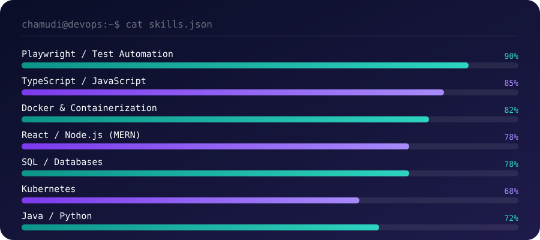

<!-- ===================== HEADER ===================== -->

  

 

<!-- ===================== ABOUT ME ===================== -->
### `$ cat about-me.md`

Computer Science undergraduate at the **University of Colombo** with industry experience in QA automation, Linux environments, CI/CD workflows, and containerization technologies. Experienced with Playwright, Docker, Kubernetes, Git, and Agile development through an internship at OrangeHRM. Currently seeking a Software Engineering or DevOps internship where I can contribute to scalable software systems while expanding my expertise in cloud-native technologies.

 

<!-- ===================== EXPERIENCE + EDUCATION ===================== -->
### `$ ls experience/ education/`

<table>
<tr>
<td width="50%" valign="top">

**💼 Software Engineer Intern —Stacknet**
*May 2026 –Presesnt*
- 

</td>
<td width="50%" valign="top">

**💼 QA Engineer Intern — OrangeHRM**
*Nov 2025 – May 2026*
- Automation testing with Playwright & TypeScript in Agile sprints
- Version control & code review via Git/GitHub
- Linux-based testing and deployment workflows
- Defect tracking and sprint management with Jira & Zoho

</td>
<td width="50%" valign="top">

**🎓 BSc. in Computer Science**
University of Colombo School of Computing
*2023 – Present*

**Advanced Level**
Sanghamitta Balika Vidyalaya, Galle
Combined Mathematics (A), Chemistry (A), Physics (B)

</td>
</tr>
</table>

 

<!-- ===================== PROJECTS ===================== -->
### `$ tree projects/`

<table>
<tr>
<td width="50%" valign="top">

**🚌 BUSMATE LK — Bus Transport Management System**
Microservices-based transport platform for SLTB and private bus operations with online ticket booking, seat reservation, and live bus tracking.
`Spring Boot` `Next.js` `TypeScript` `PostgreSQL` `Microservices`

</td>
<td width="50%" valign="top">

**♻️ Waste360 — Polythene Waste Management System**
Platform to manage collection and recycling of polythene waste, enabling public participation through organized disposal and sales channels.
`HTML` `CSS` `JavaScript` `PHP` `MySQL`

</td>
</tr>
<tr>
<td width="50%" valign="top">

**🏫 School Admin Management System**
Management platform for student enrollment, staff records, and tutorial scheduling.
`MongoDB` `Express.js` `React` `Node.js`

</td>
<td width="50%" valign="top">

**🩺 MediTrust — Healthcare Support Platform**
Platform connecting patients, doctors, and donors for prescriptions, consultations, and treatment support.
`MongoDB` `Express.js` `React` `Node.js`

</td>
</tr>
</table>

 

<!-- ===================== SKILLS CHART ===================== -->
### `$ cat skills.json`

Proficiency levels are self-rated estimates based on project & internship experience — adjust the bar widths in `skills-chart.svg` any time.

**Also working with:**

 

<!-- ===================== GITHUB STATS / CHARTS ===================== -->
### `$ git log --stats --graph`

  

 

<!-- ===================== LEADERSHIP ===================== -->
### `$ git log --author="Chamudi" --grep="leadership"`

- **IEEE Student Branch**, University of Colombo School of Computing *(2023 – 2025)*
  Content Team Lead (2024–2025) · Co-Chair, Organizing Committee — CodeQuest: Vault Edition (2025) · Member, Organizing Committee — MADHack 3.0 (2024)
- **Rotaract Club**, University of Colombo School of Computing *(2023 – 2025)*
  Treasurer (2024–2025)
- **Hackathons:** Intellihack 5.0 (IEEE Computer Society, UCSC) · IDEALIZE'25 (AIESEC, University of Moratuwa)

 

<!-- ===================== CONTACT ===================== -->
### `$ curl chamudi.dev/contact`

<!-- ===================== FOOTER ===================== -->

